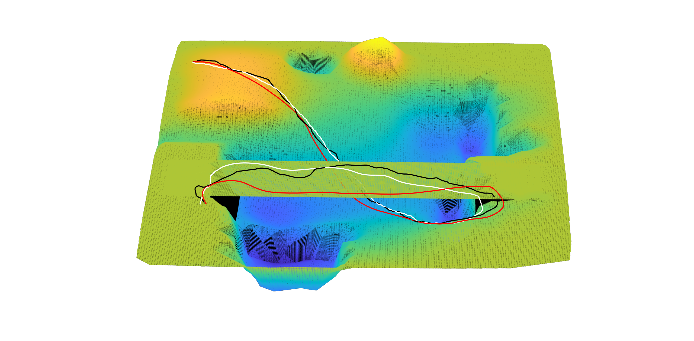

Compile: catkin_make

## Map representation
-------------------------------------------------------------------------------------
### Surfelgrid:
Surfelgrid is a novel map representation we proposed. It can be used to present environments with fluctuation and complex topologies. It is extremely practical for wheeled robot navigation task because the moving surface of the wheeled robot is sparse in z-axis, which means that the list in a grid will not be too long. It uses memory efficiently and easily to index(time complexity of indexing is approximate O(1)).
This work is not published yet. But we are willing to share the code. 
### Try Surfelgrid:
Edit std::ofstream file in Teclas::SaveMap2txt to choose a file to save the map.
Prepare:
```
handlemap.sh
```
Move the robot around, and you can see surfelgrid in rviz. The topic is PlaneMap.
Red voxels are obstacles, and grey surfels are frontiers, which can be used in exploration tasks in uneven terrains.
**step1:** start gazebo and load world
```
source devel/setup.bash; roslaunch scout_gazebo_sim scout_empty_world.launch
```
**step2:** start map server 
Parameters in the launch file is meaningless in this step.
```
source devel/setup.bash; roslaunch planeoct_server t.launch
```
**step3:** keyboard control the robot
```
rosrun teleop_twist_keyboard teleop_twist_keyboard.py
```
<video width="320" height="240" controls>
  <source src="image/github_mapping.mp4" type="video/mp4">
  Your browser does not support the video tag.
</video>

**step4:** run rviz
```
rviz -d ./show.rviz 
```

-------------------------------------------------------------------------------------
## Navigation in Surfelgrid
Run:
**step1:** start map server and call the service
You can choose a map（ExplorationUneven/src/planeoct_server/t.launch —— param name = "static_map_path"）
```
green_surfel.txt： Green buffer zone(real world, uneven)
outdoor_slop_surfel.txt： Even terrain with a slop(real world). 
underground_surfelgrid.txt:  Even terrain (real world). 
spiral_surfelgrid.txt:  underground garage (real world, uneven). 
level1.txt:  Uneven terrain (simulation world). 
level2.txt:  Uneven terrain (simulation world). 
level3.txt:  Uneven terrain (simulation world). 
multi_case1.txt:  Multi-layer uneven terrain (simulation world). 
multi_extreme_case.txt:  Multi-layer uneven terrain (simulation world). 
```
Start the map server:
```
source devel/setup.bash; roslaunch planeoct_server t.launch
rosservice call /static_map_server "data: false"
```
Show it in rviz:
```
rviz -d ./show.rviz 
```
now you can see the map. 

**step2:** prepare Tstart and Ttarget
Find two posture in this map, and write them to ExplorationUneven/src/hybrida/launch/t.launch 
They will be taken as start posture and target posture. Make sure that the posture should be exactly landed on the map(The error along the z-axis should be smaller than 0.25.) 
Of course, we have prepared some cases for you in launch file.
Make sure that the map in step1 and step2 are the same map.

**step3:** Everything is ready!
Then you can launch the navigation node and call the service：
```
source devel/setup.bash; roslaunch hybrida t.launch
rosservice call /uneven_nav "data: false"
```

Here are some results:
The red trajectory represents the proposed method, while trajectories in other colors are comparative methods.





-------------------------------------------------------------------------------------
## Parameters:
```
AstarSurPlanner::check_safe_size 
When checking whether the current pose is safe, the surfels within this range will be inspected.
AstarSurPlanner::max_milestone_step 
The smaller the number is, the less the milestones are.
Algorithm::car_size_x_2 car_size_y_2 
The size of car.（Check the safety.）
Algorithm::fourwheel_error 
If four wheels are landed on the same plane, we think this posture is safe. It is a threshold.
```